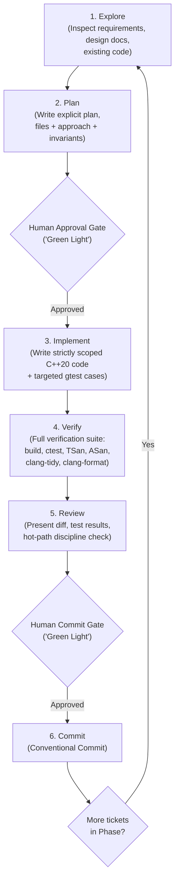

# The Standard Implementation Loop

This document defines Kestrel's engineering development process and execution protocol. All development work strictly follows this structured, human-in-the-loop lifecycle.

---

## 1. Architectural Hierarchy

Work is organized into two levels of granularity:

$$\textbf{Phase} \longrightarrow \textbf{Ticket}$$

| Level | Definition | Kestrel Example | Execution & Review Cadence |
| :--- | :--- | :--- | :--- |
| **Phase** | High-level milestone representing a complete functional capability. | Phase 1: Core Pipeline + State Machine + Basic FIX | Strategic planning & phase-level sign-off. |
| **Ticket** | The atomic unit of implementation — a single struct, algorithm, component, or integration. | "Implement `SpscRingBuffer::try_push` / `try_pop` with cache-line padding" | **Full lifecycle: Explore, Plan, Implement, Verify & Commit Gate** (per ticket). |

The four delivery phases are defined in [PRD.md §11](file:///d:/kestrel/docs/PRD.md). Ticket breakdowns are created at the start of each phase.

---

## 2. The Development Lifecycle

Every ticket moves through a single, sequential loop. **Never skip or combine steps.**



---

## 3. Per-Ticket Execution

### 1. Explore
- Read the assigned ticket definition and trace it back to the relevant requirement IDs in [PRD.md](file:///d:/kestrel/docs/PRD.md) and source design docs ([REQUIREMENTS.md](file:///d:/kestrel/docs/REQUIREMENTS.md), [CORE_ENTITIES.md](file:///d:/kestrel/docs/CORE_ENTITIES.md), [API_DESIGN.md](file:///d:/kestrel/docs/API_DESIGN.md), [LOW_LEVEL_DESIGN.md](file:///d:/kestrel/docs/LOW_LEVEL_DESIGN.md), [HIGH_LEVEL_ARCHITECTURE.md](file:///d:/kestrel/docs/HIGH_LEVEL_ARCHITECTURE.md)).
- Inspect existing codebase: headers, wire structs, ring buffer interfaces, and component boundaries to understand integration points.
- Identify whether the ticket touches the **hot path** or the **cold path** — this determines which rules apply (see §4).
- **Rule:** Do not write, edit, or modify any code during this step.

### 2. Plan
- Formulate a concise, explicit written plan:
  - Exact `.hpp`/`.cpp` files to create, modify, or delete.
  - Technical approach: data structures, algorithms, memory layout decisions.
  - Which wire struct fields or state machine transitions are affected.
  - Hot-path invariants to uphold (zero heap allocation, no mutex, no exceptions, `acquire`/`release` ordering — not `seq_cst`).
  - Targeted gtest cases to write, including edge cases and explicitly-rejected transitions.
  - Assumptions made and boundary conditions identified.
- **GATE 1 (Human Approval):** **STOP.** Present the plan to the human reviewer and wait for an explicit "green light" before writing any code.

### 3. Implement
- Once approved, write the C++20 code strictly necessary to fulfill the specific ticket.
- Write or update targeted Google Test cases covering:
  - Happy paths and edge cases for the ticket.
  - For state machine work: every `(state, event)` pair touched by this ticket has an assertion.
  - For ring buffer work: producer/consumer correctness under single-threaded test + documented TSan stress test expectation.
  - For risk checks: rejection attribution — every reject carries a `rule_id`.
- **Rule:** Maintain strict scope boundaries. No unsolicited refactoring, no tangential nice-to-haves, and no writing code for future tickets ahead of time.

### 4. Verify
Execute the complete automated verification pipeline. All stages must pass with zero errors.

1. **Build (clean):**
   ```bash
   cmake --preset release && cmake --build --preset release
   ```

2. **Unit & Integration Tests:**
   ```bash
   ctest --preset release --output-on-failure
   ```

3. **ThreadSanitizer Build & Run** (lock-free correctness — NFR-010):
   ```bash
   cmake --preset tsan && cmake --build --preset tsan
   ctest --preset tsan --output-on-failure
   ```
   Zero data races required. Any TSan report is a blocking failure.

4. **AddressSanitizer Build & Run** (memory safety):
   ```bash
   cmake --preset asan && cmake --build --preset asan
   ctest --preset asan --output-on-failure
   ```
   Zero memory errors required.

5. **Static Analysis & Formatting:**
   ```bash
   clang-tidy --config-file=.clang-tidy src/**/*.cpp
   clang-format --dry-run --Werror src/**/*.hpp src/**/*.cpp
   ```

### 5. Review
- Present a clear summary of the changes made:
  - Modified/created files and key technical decisions.
  - Full verification suite results from step 4.
  - Hot-path discipline confirmation: any new code on the hot path is allocation-free, lock-free, exception-free.
- **GATE 2 (Human Commit Approval):** **STOP.** Present the verification results and proposed commit message. Wait for explicit confirmation before committing.

### 6. Commit
- Draft a clean, descriptive commit message adhering to the **Conventional Commits** specification:
  - `feat:` — new functionality (e.g., `feat: implement SpscRingBuffer with cache-line padding`)
  - `fix:` — bug fix
  - `test:` — test additions/changes only
  - `refactor:` — code restructuring with no behavior change
  - `perf:` — performance improvement (e.g., `perf: replace modulo with bitmask in ring buffer indexing`)
  - `docs:` — documentation only
  - `chore:` — build system, CI, tooling changes
- Commit the changes to Git.

---

## 4. Kestrel-Specific Rules of Engagement

### 4.1 Human-in-the-Loop Supremacy
- The human directs, reviews, and approves at every gate; the agent plans, executes, and verifies.
- Never assume approval or bypass a review gate.

### 4.2 Strict Scope Isolation
- Implement exactly one ticket at a time.
- If an adjacent issue, bug, or optimization opportunity is discovered outside the current ticket scope, **document it as a new ticket** for later rather than improvising unapproved fixes.

### 4.3 Hot-Path Discipline
The hot path (order receipt → risk check → routing decision) has non-negotiable constraints from [PRD.md §7.1](file:///d:/kestrel/docs/PRD.md) and [API_DESIGN.md §1](file:///d:/kestrel/docs/API_DESIGN.md):

| Rule | What it means in practice |
| :--- | :--- |
| **Zero heap allocation** (NFR-003) | No `new`, `malloc`, `std::string`, `std::vector::push_back`, or any container growth on pinned threads. Use `OrderPool`, fixed `char[N]` fields, pre-allocated `std::array`. |
| **No mutexes** | SPSC ring buffers with `acquire`/`release` atomics only. No `std::mutex`, `std::lock_guard`, or condition variables on the hot path. |
| **No exceptions** | All hot-path functions are `noexcept`. Failures return error codes or `std::optional`/`bool`. |
| **No virtual dispatch** (debatable for risk rules) | Wire structs are POD. Pipeline stage boundaries are concrete `SpscRingBuffer` instances, not virtual interfaces. `IRiskRule` is the documented exception — revisit only if profiling demands it. |
| **Monotonic timestamps only** | `clock_gettime(CLOCK_MONOTONIC)` — never mixed with wall-clock time. `mono_ts_ns` in every wire struct. |

Any code that violates these rules on the hot path is a **blocking review failure**, regardless of whether tests pass.

### 4.4 Two Representations, Always
Every entity that appears on the hot path must have both forms defined before implementation ([CORE_ENTITIES.md §1](file:///d:/kestrel/docs/CORE_ENTITIES.md)):
- **Domain form** — rich, safe, possibly-heap-backed (used in tests, config, audit tooling)
- **Wire form** — flat, fixed-size POD struct with no pointers (passed through ring buffers)

If a ticket introduces a new entity on the hot path and only defines one form, the ticket is incomplete.

### 4.5 State Machine Exhaustiveness
The order state machine ([LOW_LEVEL_DESIGN.md §2](file:///d:/kestrel/docs/LOW_LEVEL_DESIGN.md)) is a compile-time transition table, not scattered `if`/`else`:
- Every `(OrderState, OrderEvent)` pair has an explicit outcome: either a legal transition or `Rejected`.
- Any ticket that modifies the transition table must update the exhaustive enumeration test to cover all new pairs.
- There is no "unhandled" case. Default is `Rejected`, not undefined behavior.

### 4.6 Deterministic Replay Compatibility
Any change to the hot path must preserve deterministic replay (FR-051, NFR-030):
- Risk rule evaluation order is fixed and sequential — no parallelization, no non-deterministic ordering.
- If a change could alter the order of events in the capture log or the outcome of replayed sessions, it must be flagged in the plan (Step 2) and explicitly approved.

### 4.7 Design Document Traceability
- Every ticket must reference the requirement IDs (FR-xxx, NFR-xxx) it implements or advances.
- Conflicts between a ticket requirement and the design docs ([PRD.md](file:///d:/kestrel/docs/PRD.md), [REQUIREMENTS.md](file:///d:/kestrel/docs/REQUIREMENTS.md), [API_DESIGN.md](file:///d:/kestrel/docs/API_DESIGN.md), etc.) must be surfaced immediately at the Plan step — never silently resolved during implementation.

### 4.8 Dynamic Reference Context
- All requirement specifications, architectural constraints, and ticket definitions are sourced directly from the active documentation hierarchy in [`docs/`](file:///d:/kestrel/docs).
- The [PRD.md](file:///d:/kestrel/docs/PRD.md) is the single source of truth for scope and resolved decisions. The source design docs remain canonical for implementation-level detail.
